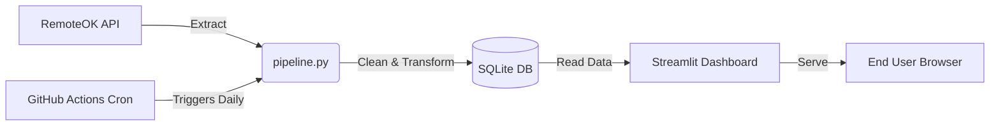

\# 🌐 Automated Remote Tech Jobs Intelligence Pipeline


An end-to-end data pipeline that extracts remote tech job listings daily, standardizes and cleans the schema, stores records in an optimized SQLite database, and exposes an interactive analytics dashboard via Streamlit Community Cloud.


\## 🚀 Live Demo

\- \*\*Live Interactive Dashboard:\*\* \[https://remote-tech-jobs-tracker.streamlit.app/]


\## 🛠️ Architecture \& Tech Stack

\- \*\*Ingestion \& ETL:\*\* Python (`requests`, `beautifulsoup4`, `pandas`, `ftfy`, `sqlalchemy`)

\- \*\*Database:\*\* SQLite (`remote\_tech\_jobs.db`)

\- \*\*Automation / Orchestration:\*\* GitHub Actions (scheduled daily cron workflow at 06:00 UTC)

\- \*\*Frontend / Visualization:\*\* Streamlit, Plotly Express

\- \*\*Deployment:\*\* Streamlit Community Cloud


\## 📐 Pipeline Flow

1\. \*\*Extract:\*\* Scrapes real-time listings across 19 technical domains via the RemoteOK API, respecting rate limits.

2\. \*\*Transform:\*\* Normalizes messy location entities, decodes character encoding (mojibake), cleans HTML tags, strips formatting anomalies, and handles null/salary ranges.

3\. \*\*Load:\*\* Automatically inserts cleaned records into SQLite.

4\. \*\*Automate:\*\* GitHub Actions provisions an Ubuntu runner daily to trigger `pipeline.py` and commit the updated database back to source control.

5\. \*\*Serve:\*\* Streamlit queries the updated database on load to display top skills, salary metrics, and filterable job roles.




\## 💻 Local Setup

1\. Clone repository:

&#x20;  ```bash

&#x20;  git clone \[https://github.com/User-Adarsh007/remote-tech-jobs-pipeline.git](https://github.com/User-Adarsh007/remote-tech-jobs-pipeline.git)

&#x20;  cd remote-tech-jobs-pipeline

